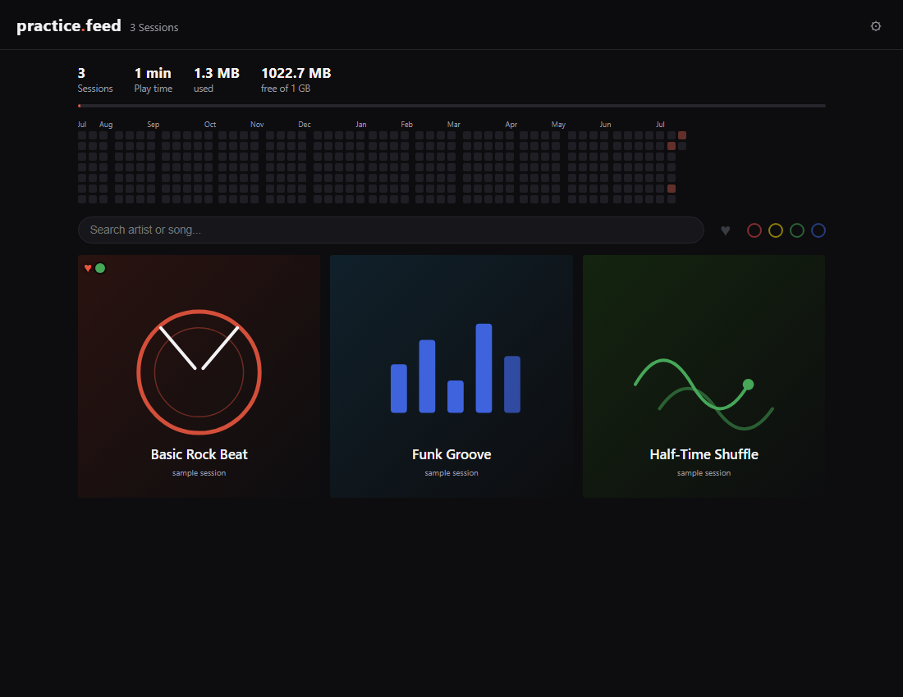

# practice.feed

Your own private Instagram-style feed for music practice recordings — a single
HTML file, no accounts, no server, free hosting on GitHub Pages.



Record a practice session, add it to the feed, and listen back from any device.
Click a session to play it with a SoundCloud-style timeline: drop comments
pinned to the exact second ("rushed the fill here"), like sessions, colour-tag
them, and watch your practice streak grow on a GitHub-style calendar.

Built for drummers, works for any instrument.

> **Fair warning: this is vibe-coded.** An AI and I built it together, and it
> works great for me — but read it with that in mind. If it helped you, you can
> [buy me a coffee](https://buymeacoffee.com/tom.p) and help me pay the
> Claude subscription that built it. ☕

## ⚠️ You are responsible for what you upload

**This is a tool, not a service.** If you practice along to commercial music,
the recording you upload contains that music, and publishing it on a public
site can infringe the rights of the artists and labels involved. Keep your
feed private (unlisted URL, private repo where possible), upload only what you
have the rights to share, or keep the backing track out of the recording.
Whatever you publish, you publish — same as uploading it anywhere else.

## Get your own

1. Click **Use this template** (top right on GitHub) → create your repository.
2. In your new repo: **Settings → Pages → Branch: `main`** → Save.
3. Wait a minute — your feed is live at `https://YOURNAME.github.io/YOURREPO/`.

The three sample sessions (synthesized drum loops, free to reuse) show you
around. Delete them once you have real sessions: remove their entries from
`sessions.json` and the matching files in `audio/` and `pictures/`.

## Adding a session

**With the helper script** (needs Python, [ffmpeg](https://ffmpeg.org)
optional but recommended): clone your repo locally, run `python add_session.py`,
pick your recording and a cover picture, confirm artist/song, done. If the
folder is a git clone it commits and pushes automatically — the session is
live seconds later.

**By hand:** drop an audio file into `audio/`, a picture into `pictures/`,
and add an entry at the top of `sessions.json`:

```json
{
  "id": "unique-slug",
  "title": "Artist - Song [take 3]",
  "artist": "Artist",
  "song": "Song",
  "session": 42,
  "date": "2026-07-21",
  "audio": "audio/your-file.mp3",
  "picture": "pictures/your-picture.jpg",
  "duration": 183.5,
  "size": 4816293
}
```

| Field      | Meaning                                                        |
|------------|----------------------------------------------------------------|
| `id`       | Unique string, used to attach comments/reactions to a session  |
| `title`    | Fallback name, shown when `song` is empty                      |
| `artist`   | Shown under the song name (optional, may be `""`)              |
| `song`     | Main name shown on the tile and in the player                  |
| `session`  | Your running session number (or `null`)                        |
| `date`     | ISO date `YYYY-MM-DD` — feeds the calendar and sorting         |
| `audio`    | Path to the recording, relative to `index.html`                |
| `picture`  | Path to the cover image, relative to `index.html`              |
| `duration` | Length in seconds (or `null`) — feeds the play-time stat       |
| `size`     | Audio + picture size in bytes — feeds the storage stat         |

## Make it yours

Open `index.html` and edit the `CONFIG` block at the top of the `<script>`:
site name, accent colour, language (English and German ship out of the box —
add your own by copying a `STRINGS` entry), date format, storage limit.
That block is the only place you need to touch.

## Comments & reactions are local-only by default

Comments, likes and tags you add in the browser are stored **in that browser
only** (localStorage). They survive reloads, but they are not visible to other
visitors, don't follow you to another device, and disappear if you clear site
data. To make them permanent for everyone, commit them into `comments.json` /
`reactions.json` — everything committed there is shown to all visitors.

### The sync feature (⚙) — read before using

The gear button can write comments straight to your repo via the GitHub API
using a personal access token. **This is for single-user setups only:**

- The token is stored in your browser's localStorage. On GitHub Pages that
  storage is shared across **every** site on your `*.github.io` domain — any
  of them could read the token.
- Anyone who should write comments needs write access to your repo.
- Two people commenting at the same time can silently overwrite each other.

If you want real multi-user comments, put the token behind a tiny server
(a free-tier Cloudflare Worker that accepts a comment and commits it is
enough) instead of shipping it to browsers.

## GitHub Pages limits (audio adds up fast)

Numbers from [GitHub's docs](https://docs.github.com/en/pages/getting-started-with-github-pages/github-pages-limits):

- Published sites may be **no larger than 1 GB**. At ~1 MB per recorded
  minute (128 kbps MP3) that's roughly 16 hours of audio. The stats bar at
  the top of the feed tracks how much you've used.
- **Soft bandwidth limit of 100 GB per month** — fine for personal use, not
  for going viral.
- Soft limit of **10 builds per hour** — publishing many sessions back to
  back may briefly delay updates.

## Staying unlisted

Line 6 of `index.html` sets `noindex, nofollow`, which asks search engines
not to list your feed. Anyone with the URL can still open it. Delete that
line if you *want* to be discoverable.

## License

[MIT](LICENSE) — fork it, bend it, make it yours.
